# Video Generation Pipeline

## Overview

```text
┌──────────────────────────────────────────────────────────────────────────────┐
│ 📁 PRODUCT RESOURCE DIRECTORY                                                │
│ .md .txt .pdf .docx .json .yaml .csv .xlsx .png .jpg .mp4 .mov .srt .vtt     │
│ Existing PPTX files: one deck is reused; multiple decks → LLM reference text      │
└──────────────────────────────────┬───────────────────────────────────────────┘
                                   │
                                   ▼
┌──────────────────────────────────────────────────────────────────────────────┐
│ Stage 0 · AUTO-SCAN                                                          │
│ scan() · categorize resources by extension                                   │
└──────────────────────────────────┬───────────────────────────────────────────┘
                                   │
                                   ▼
┌──────────────────────────────────────────────────────────────────────────────┐
│ Stage 1 · VISION (optional)                                                  │
│ Images + PPTX slides + video keyframes + PDF/DOCX pages → Pi Vision LLM      │
│ → vision-analysis.json                                                       │
└──────────────────────────────────┬───────────────────────────────────────────┘
                                   │  👤 Approve Vision (when enabled)
                                   ▼
┌──────────────────────────────────────────────────────────────────────────────┐
│ Stage 2 · LLM DRAFT                                                          │
│ Content + tables + PPTX text + video transcripts + Vision results            │
│ → Pi LLM (CodeMie / DIAL / ELITEA) → content-draft.json                      │
│    outline · EN narration · ZH narration                                     │
└──────────────────────────────────┬───────────────────────────────────────────┘
                                   │  👤 Approve Draft
                                   ▼
┌──────────────────────────────────────────────────────────────────────────────┐
│ Stage 3 · BUILD PPT                                                          │
│ outline + image files → python-pptx → outputs/presentation.pptx            │
│ PowerPoint COM / macOS PowerPoint / LibreOffice → presentation.pdf          │
└──────────────────────────────────┬───────────────────────────────────────────┘
                                   │  👤 Review PPT/PDF
                                   ▼
┌──────────────────────────────────────────────────────────────────────────────┐
│ Stage 4 · BUILD AUDIO + SUBTITLES                                            │
│ EN/ZH narration → Azure Neural TTS → primary.wav / secondary.wav             │
│ word boundaries → SRT / WebVTT → automatically accepted for local review     │
└──────────────────────────────────┬───────────────────────────────────────────┘
                                   │
                                   ▼
┌──────────────────────────────────────────────────────────────────────────────┐
│ Stage 5 · BUILD VIDEO                                                        │
│ PPTX/PDF frames + WAV + VTT → FFmpeg → primary / secondary / dual MP4        │
└──────────────────────────────────┬───────────────────────────────────────────┘
                                   │
                                   ▼
┌──────────────────────────────────────────────────────────────────────────────┐
│ Stage 6 · LOCAL REVIEW & DELIVERY                                            │
│ Review and download locally; upload manually to the company platform         │
└──────────────────────────────────────────────────────────────────────────────┘
```

## Interactive diagram (Mermaid)

```mermaid
flowchart TD
    subgraph INPUT["📁 Product Resource Directory"]
        CF["Content files\n.md / .txt / .pdf / .docx\n.json / .yaml / .xml"]
        TF["Table files\n.csv / .xlsx"]
        IF["Image files\n.png / .jpg / .webp…"]
        PX["Existing PPTX\n(optional)"]
    end

    subgraph SCAN["0 · Auto-scan"]
        S1["scan(root)\ncategorize by extension"]
    end

    subgraph VISION["1 · Vision Analysis  ⬡ optional"]
        V1["vision_input_pages()\nrender PDF/DOCX pages\nto images via PyMuPDF"]
        V2["Pi → Vision LLM\ngpt-4.1 / CodeMie model"]
        V3["vision-analysis.json\ntype · description · visible_text\nkey_points · alt_text\nsuggested_slide · confidence"]
        VA(["👤 Review &\nApprove Vision"])
    end

    subgraph LLM["2 · LLM Draft Generation"]
        L1["_read_document()\nextract plain text\nUTF-8 → cp1252 → latin-1"]
        L2["Prompt: product materials\n+ vision analysis\n+ image filenames"]
        L3["Pi → LLM\nCodeMie / DIAL / ELITEA"]
        L4["content-draft.json\noutline · primary_narration\nsecondary_narration"]
        L5["narration-primary.json\nnarration-secondary.json"]
        LA(["👤 Edit &\nApprove Draft"])
    end

    subgraph PPT["3 · Build PPT"]
        P1["create_presentation_from_outline()\npython-pptx\nslide per outline entry\nimage placement via suggested_slide"]
        P2["outputs/presentation.pptx"]
        P3["render_presentation_pdf()\nPowerPoint COM / macOS automation → PDF\nLibreOffice → PDF (fallback)"]
        P4["outputs/presentation.pdf"]
        PA(["👤 Review PDF &\nGUI accepts before audio"])
    end

    subgraph AUDIO["4 · Build Audio + Subtitles"]
        A1["synthesize_project_language()\nAzure Speech SDK\nslide-by-slide SSML\nword-boundary events"]
        A2["audio-primary/slide-*.wav\naudio-secondary/slide-*.wav"]
        A3["primary-manifest.json\nsecondary-manifest.json\n(word boundaries + timings)"]
        A4["_combine_audio()\nprimary.wav  =  EN + silence padding\nsecondary.wav  =  ZH + silence padding"]
        A5["prepare_review_audio()\nFFmpeg atempo fit\nto target duration"]
        A6["review-primary.wav\nreview-secondary.wav"]
        A7["generate_subtitles()\nword boundaries → cue timings\nproportional split for long sentences"]
        A8["outputs/\npresentation-primary.srt/.vtt\npresentation-secondary.srt/.vtt\npresentation-bilingual.srt/.vtt\n(auto-accepted for local review)"]
        A9(["👤 Review audio + subtitles locally"])
    end

    subgraph VIDEO["5 · Build Video"]
        VI1["build_video()\nresolve renderer"]
        VI2a["PowerPoint COM / macOS automation\npptx → PDF → per-slide PNG\n+ visual.mp4"]
        VI2b["LibreOffice + pdftoppm\npptx → pdf → slide-*.png\n(fallback)"]
        VI3["FFmpeg\nslide images + primary.wav\n+ primary.vtt subtitles"]
        VI4["FFmpeg\nslide images + secondary.wav\n+ secondary.vtt subtitles"]
        VI5["FFmpeg\ndual-track audio stream\n+ bilingual.vtt subtitles"]
        VI6["outputs/presentation-primary.mp4"]
        VI7["outputs/presentation-secondary.mp4"]
        VI8["outputs/presentation-dual.mp4"]
    end

    subgraph DELIVERY["6 · Local Review & Delivery"]
        D1["👤 Review videos locally\nin browser player"]
        D2["Download PPTX · PDF\naudio · SRT/VTT · MP4"]
        D3["📤 Manual upload\nto company platform"]
    end

    INPUT --> SCAN
    SCAN --> VISION
    SCAN --> LLM

    IF --> V1
    CF --> V1
    VF -.->|"keyframes
(FFmpeg)"| V1
    PX -.->|"PPTX slides
rendered"| V1
    V1 --> V2
    V2 --> V3
    V3 --> VA
    VA --> LLM

    CF --> L1
    TF --> L1
    IF -.->|"filenames only"| L2
    PX -.->|"slide text
+ notes"| L2
    VF -.->|"transcripts
(.srt/.vtt)"| L2
    L1 --> L2
    V3 -.->|"if approved"| L2
    L2 --> L3
    L3 --> L4
    L4 --> L5
    L4 --> LA
    L5 --> LA

    LA -->|"approved draft"| PPT
    PX -.->|"one source: reuse; multiple sources: LLM reference"| L2

    P1 --> P2
    L4 -->|outline| P1
    IF -->|"image files\n+ suggested_slide"| P1
    P2 --> P3
    P3 --> P4
    P4 --> PA

    PA -->|"approved PPT"| AUDIO

    L5 -->|primary_narration| A1
    L5 -->|secondary_narration| A1
    A1 --> A2
    A1 --> A3
    A2 --> A4
    A4 --> A5
    A5 --> A6
    A3 -->|word boundaries| A7
    A6 --> A7
    A7 --> A8

    A8 --> A9
    A9 --> VIDEO

    VI1 --> VI2a
    VI1 --> VI2b
    VI2a --> VI3
    VI2b --> VI3
    VI2a --> VI4
    VI2b --> VI4
    VI2a --> VI5
    VI2b --> VI5
    P2 --> VI1
    A4 -->|primary.wav| VI3
    A4 -->|secondary.wav| VI4
    A4 -->|primary.wav\n+secondary.wav| VI5
    A8 -->|primary.vtt| VI3
    A8 -->|secondary.vtt| VI4
    A8 -->|bilingual.vtt| VI5
    VI3 --> VI6
    VI4 --> VI7
    VI5 --> VI8

    VI6 --> D1
    VI7 --> D1
    VI8 --> D1
    D1 --> D2
    D2 --> D3

    style VA fill:#f59e0b,color:#000
    style LA fill:#f59e0b,color:#000
    style PA fill:#f59e0b,color:#000
    style A9 fill:#f59e0b,color:#000
    style D1 fill:#f59e0b,color:#000
    style D3 fill:#10b981,color:#fff
    style VISION fill:#1e3a5f,color:#fff
    style LLM fill:#1e3a5f,color:#fff
    style PPT fill:#1e3a5f,color:#fff
    style AUDIO fill:#1e3a5f,color:#fff
    style VIDEO fill:#1e3a5f,color:#fff
    style DELIVERY fill:#1e3a5f,color:#fff
    style INPUT fill:#0f2540,color:#fff
```



## Stage summary

| Stage | Input | Key function | Output | Approval |
|-------|-------|-------------|--------|---------|
| **0 Scan** | Resource directory | `scan(root)` | File categorization | — |
| **1 Vision** _(optional)_ | Images, PDF/DOCX pages, PPTX slides, video keyframes | `vision_input_pages()` → Pi Vision LLM | `vision-analysis.json` | ✅ Required if run |
| **2 Draft** | Content + tables + PPTX text + video transcripts + vision | `generate_content_draft()` → Pi LLM | `content-draft.json`, narration files | ✅ Required |
| **3 PPT** | outline, image files | `create_presentation_from_outline()` | `outputs/presentation.pptx`, `presentation.pdf` | ✅ Required |
| **4 Audio + Subtitles** | narration JSON, Azure Speech | `synthesize_project_language()` | per-slide WAV, merged WAV, SRT/VTT | ✅ Automatically accepted; local review |
| **5 Video** | PPTX, audio WAV, VTT | `build_video()` via FFmpeg | primary / secondary / dual MP4 | — (review only) |
| **6 Delivery** | MP4 + PPTX + SRT/VTT | — | Local files | — (manual upload) |

## Key files under `.video-work/`

```text
.video-work/
├── vision-pages/                 # Rendered PNG frames (PDF pages, PPTX slides, video keyframes)
├── vision-analysis.json          # Vision LLM output (optional)
├── content-draft.json            # LLM outline + narrations
├── narration-primary.json        # Per-slide EN narration
├── narration-secondary.json      # Per-slide ZH (or other) narration
├── audio-primary/slide-*.wav    # Per-slide EN audio
├── audio-secondary/slide-*.wav  # Per-slide ZH audio
├── primary-manifest.json         # Word boundaries + timings (EN)
├── secondary-manifest.json       # Word boundaries + timings (ZH)
├── primary.wav                   # Merged dual-track EN WAV
├── secondary.wav                 # Merged dual-track ZH WAV
├── review-primary.wav            # Tempo-adjusted EN preview
├── review-secondary.wav          # Tempo-adjusted ZH preview
└── approvals.json                # Stage approval record

outputs/
├── presentation.pptx
├── presentation.pdf
├── presentation-primary.srt/.vtt
├── presentation-secondary.srt/.vtt
├── presentation-bilingual.srt/.vtt
├── presentation-primary.mp4
├── presentation-secondary.mp4
└── presentation-dual.mp4
```

## Renderer selection

```text
VIDEO_RENDERER=auto  (default)
    ├── PowerPoint available?  →  PowerPoint (COM on Windows, macOS automation on Mac)
    └── fallback               →  LibreOffice soffice + Poppler pdftoppm

VIDEO_RENDERER=powerpoint  →  force PowerPoint (where available)
VIDEO_RENDERER=libreoffice →  force LibreOffice + pdftoppm
```

## Approval gates

```text
Vision  →  Draft  →  PPT  →  Audio + Subtitles  →  Video (review only)
  ↑          ↑        ↑
  explicit approval gates             automatic acceptance / local review

Only Vision, Draft, and PPT require explicit approval in the Web GUI.
Audio and subtitles are automatically accepted after generation and do not block video rendering.
```
